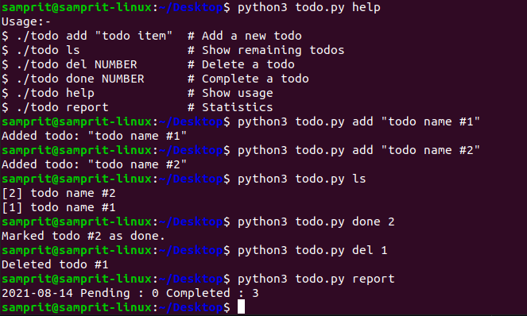

# Todo-App
Handle all your todos from your very own terminal
- Guide to use
```
python3 todo.py add "todo name #1"
python3 todo.py add "todo name #2"
python3 todo.py 
python3 todo.py
python3 todo.py
python3 todo.py
```

